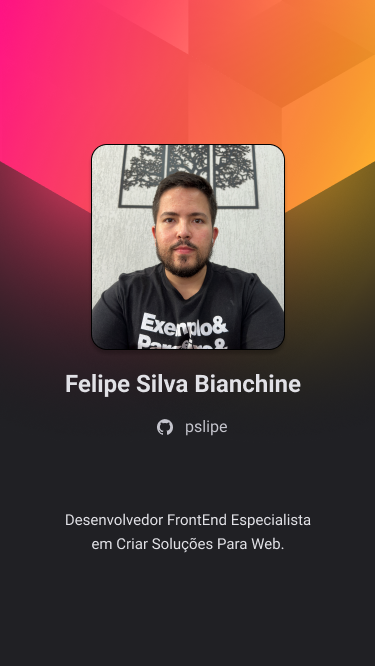

<h1 align="left">Hi , I'm Felipe Silva Bianchine</h1>

  

- 🔥 Junior WEB Developer, constantly evolving and always working to build a more technological future.

- 🔭 I am currently looking for a professional outplacement and working as a freelance developer.

- 💬 Ask me about **JavaScript, React, TypeScript, HTML, CSS, SQL, Node.JS**

- ⚡ Fun fact **Oneye 😜**

- 👨‍💻 More at [Instagram](https://www.instagram.com/pslipe/)
<!--
**pslipe/pslipe** is a ✨ _special_ ✨ repository because its `README.md` (this file) appears on your GitHub profile.

Here are some ideas to get you started:

- 🔭 I’m currently working on ...
- 🌱 I’m currently learning ...
- 👯 I’m looking to collaborate on ...
- 🤔 I’m looking for help with ...
- 💬 Ask me about ...
- 📫 How to reach me: ...
- 😄 Pronouns: ...
- ⚡ Fun fact: ...
-->
